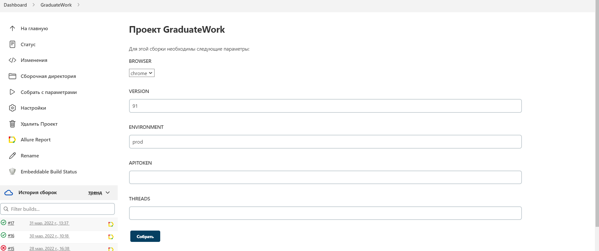
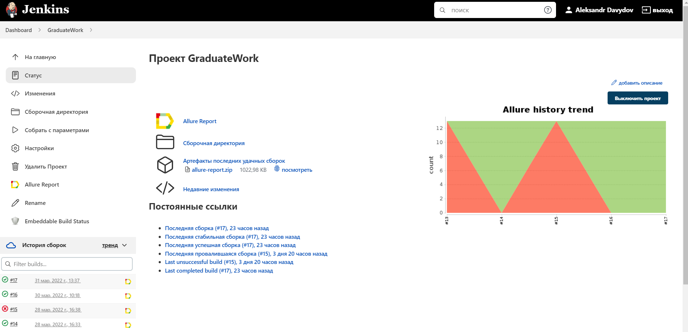
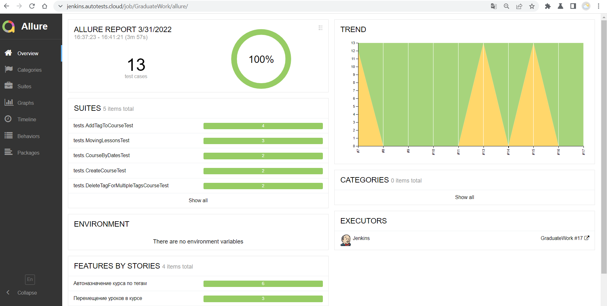
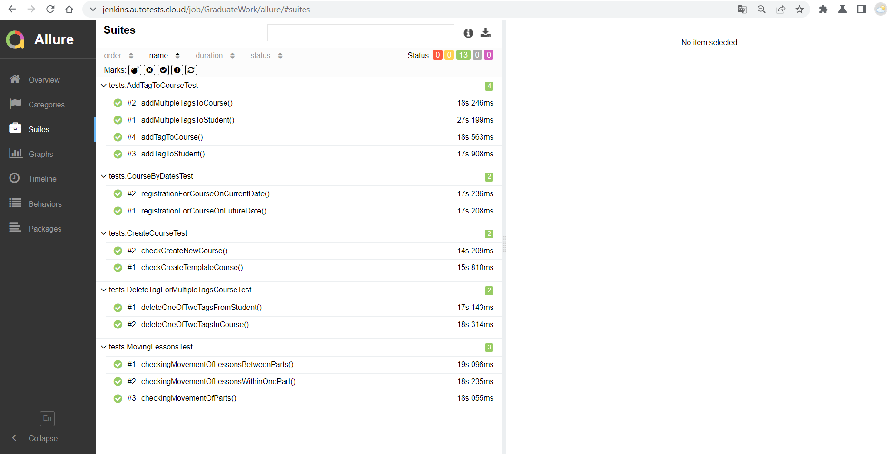
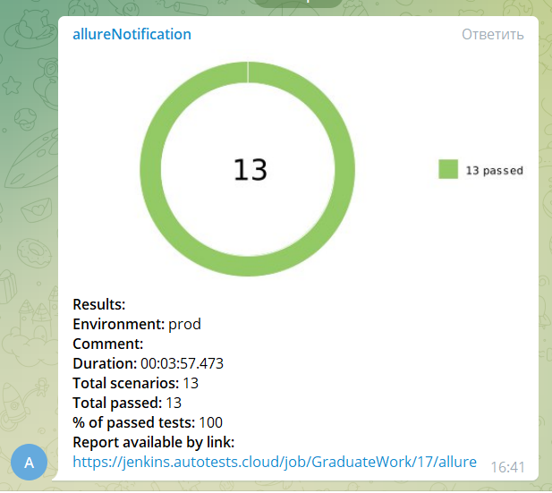

<p align="right">
<a href="https://visitor-badge-reloaded.herokuapp.com/badge?page_id=Alfirine/QA.GURU&color=55acb7&style=flat&logo=Github&text=Hello_Visitors!">
  
  
</a>
</p>

# QA.GURU. Дипломная работа. Тесты для webinar.ru :star:

## UI тесты с API предусловиями
:white_check_mark: Add single tag to course     
:white_check_mark: Add multiple tags to course     
:white_check_mark: Delete tags in course    
:white_check_mark: Add single tag to student     
:white_check_mark: Add multiple tags to student    
:white_check_mark: Delete tags from student    
:white_check_mark: Registration for course on current date    
:white_check_mark: Registration for course on future date    
:white_check_mark: Create new course    
:white_check_mark: Create template course    
:white_check_mark: Movement of lessons within one part    
:white_check_mark: Movement of lessons between parts    
:white_check_mark: Movement of parts

## :rocket: Технологии и инструменты

<p  align="left"

<code></code>
<code></code>
<code></code>
<code></code>
<code></code>
<code></code>
<code></code>
<code></code>
<code></code>
<code></code>
<code></code>
<code></code>
</p>

## :computer: Запуск тестов из терминала

&nbsp;&nbsp;&nbsp;&nbsp;&nbsp;&nbsp;:green_circle:&nbsp;&nbsp;*Запуск тестов с заполненным remote.properties:*

```bash
gradle clean test
```

&nbsp;&nbsp;&nbsp;&nbsp;&nbsp;&nbsp;:green_circle:&nbsp;&nbsp;*Запуск тестов без заполненного remote.properties:*

```bash
gradle clean test 
  -Dbrowser=[BROWSER]
  -DbrowserVersion=[BROWSER_VERSION]
  -DbrowserSize=[BROWSER_SIZE]
  -DremoteDriverUrl=https://[REMOTE_DRIVER_URL]/wd/hub/
  -Dthreads=[THREADS]
  -DapiToken=[APITOKEN]
```

где:
>- [x] *-Dbrowser - браузер, в котором будут выполняться тесты (по умолчанию chrome)*
>- [x] *-DbrowserVersion - версия браузера (по умолчанию 91.0)*
>- [x] *-DbrowserSize - размер окна браузера (по умолчанию 1920x1080)*
>- [x] *-DremoteDriverUrl - адрес удаленного сервера, где будут выполняться тесты (по умолчанию http://selenoid.autotests.cloud/wd/hub/)*
>- [x] *-Dthreads - количество потоков выполняющихся тестов*
>- [x] *-DapiToken - токен, для доступа к API*

&nbsp;&nbsp;&nbsp;&nbsp;&nbsp;&nbsp;:green_circle:&nbsp;&nbsp;*Запуск тестов в несколько потоков:*

```bash
gradle clean test -Dthreads=[threadsValue]
```

&nbsp;&nbsp;&nbsp;&nbsp;&nbsp;&nbsp;:green_circle:&nbsp;&nbsp;*Сформировать allure отчет:*

```bash
allure serve build/allure-results
```
##  Запуск тестов в [Jenkins](https://jenkins.autotests.cloud/job/GraduateWork/17/)

### :pushpin: Параметры сборки

    BROWSER (по умолчанию chrome)
    BROWSER_VERSION (по умолчанию 91.0)
    ENVIRONMENT (название тестового стенда)
    APITOKEN (токен для доступа к API)
    THREADS (число потоков)

*Для запуска сборки необходимо указать значения параметров и нажать кнопку <code><strong>*Собрать*</strong></code>.*

<p align="left">
  
</p>

*После выполнения сборки, в блоке <code><strong>*История сборок*</strong></code> напротив номера сборки появится
значок <code><strong>*Allure
Report*</strong></code>, кликнув по которому, откроется страница с сформированным html-отчетом.*

<p align="left">
  
</p>

##  Отчет о результатах тестирования в [Allure Report](https://jenkins.autotests.cloud/job/GraduateWork/17/allure/)


### :pushpin: Общая информация

*Главная страница Allure-отчета содержит следующие информационные блоки:*

> - [x] <code><strong>*ALLURE REPORT*</strong></code> - отображает дату и время прохождения теста, общее количество прогнанных кейсов, а также диаграмму с указанием процента и количества успешных, упавших и сломавшихся в процессе выполнения тестов
>- [x] <code><strong>*TREND*</strong></code> - отображает тренд прохождения тестов от сборки к сборке
>- [x] <code><strong>*SUITES*</strong></code> - отображает распределение результатов тестов по тестовым наборам
>- [x] <code><strong>*ENVIRONMENT*</strong></code> - отображает тестовое окружение, на котором запускались тесты (в данном случае информация не задана)
>- [x] <code><strong>*CATEGORIES*</strong></code> - отображает распределение неуспешно прошедших тестов по видам дефектов
>- [x] <code><strong>*FEATURES BY STORIES*</strong></code> - отображает распределение тестов по функционалу, который они проверяют
>- [x] <code><strong>*EXECUTORS*</strong></code> - отображает исполнителя текущей сборки (ссылка на сборку в Jenkins)

<p align="left">
  
</p>

### :pushpin: Список тестов c описанием шагов

*На данной странице представляется стандартное распределение выполнявшихся тестов по тестовым наборам или классам, в
которых находятся тестовые методы.*

<p align="left">
  
</p>

##  Уведомления в Telegram

<p align="left">
  
</p>

## Контакты
[](https://github.com/Alfirine)
[](https://t.me/Alfirin) 
